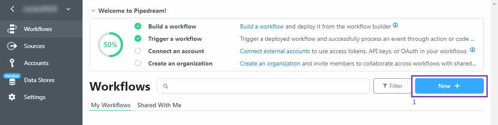
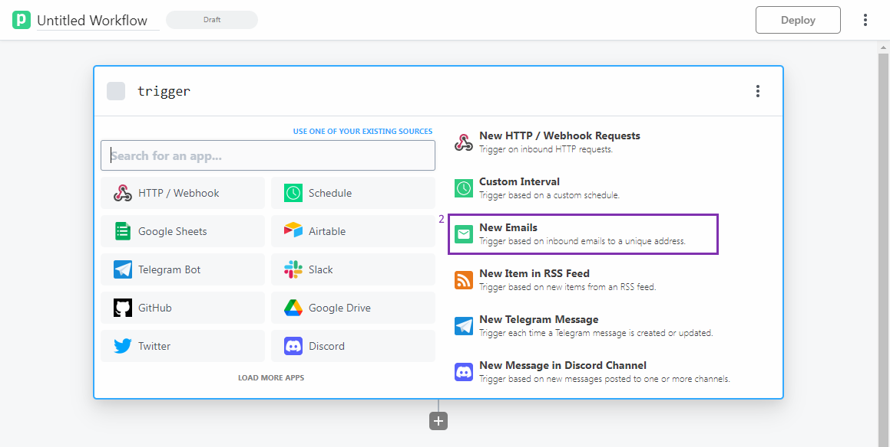
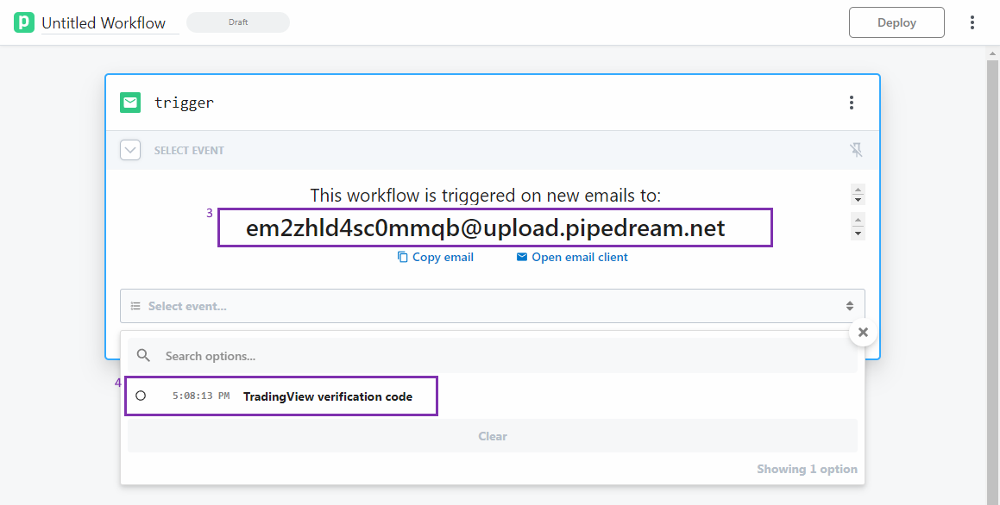
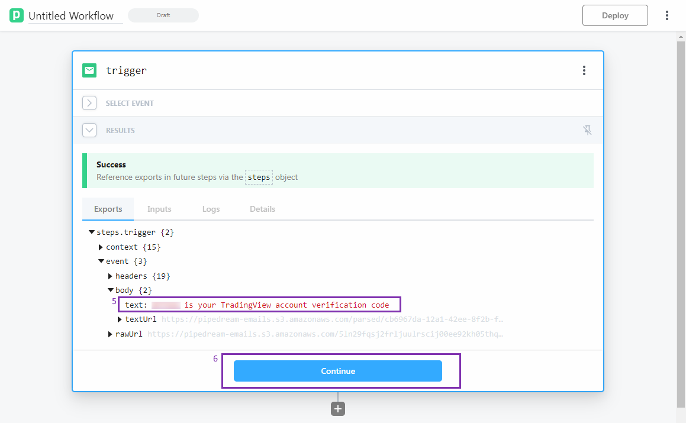
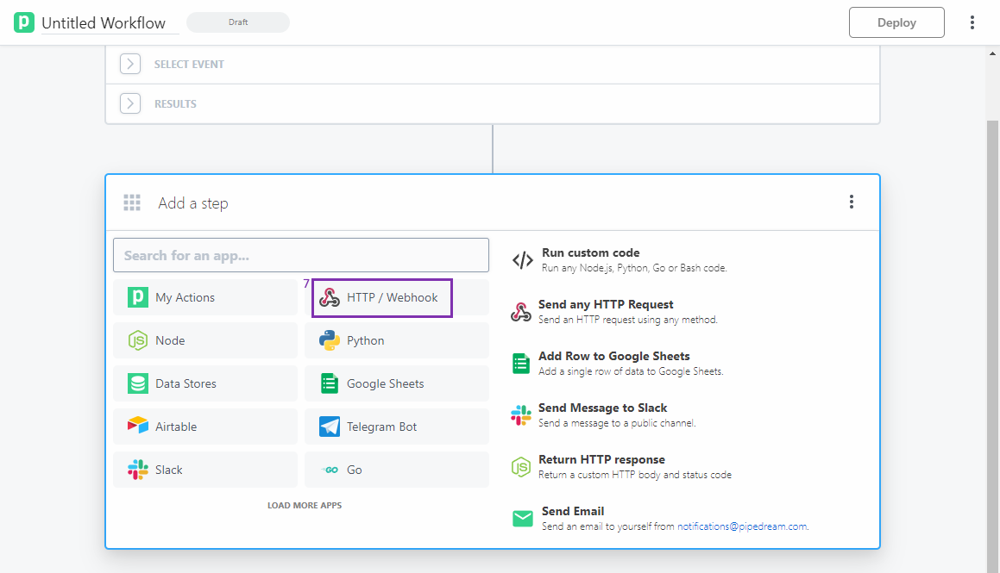
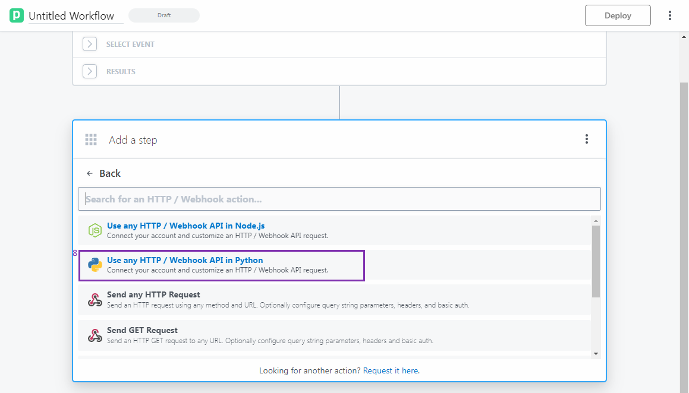
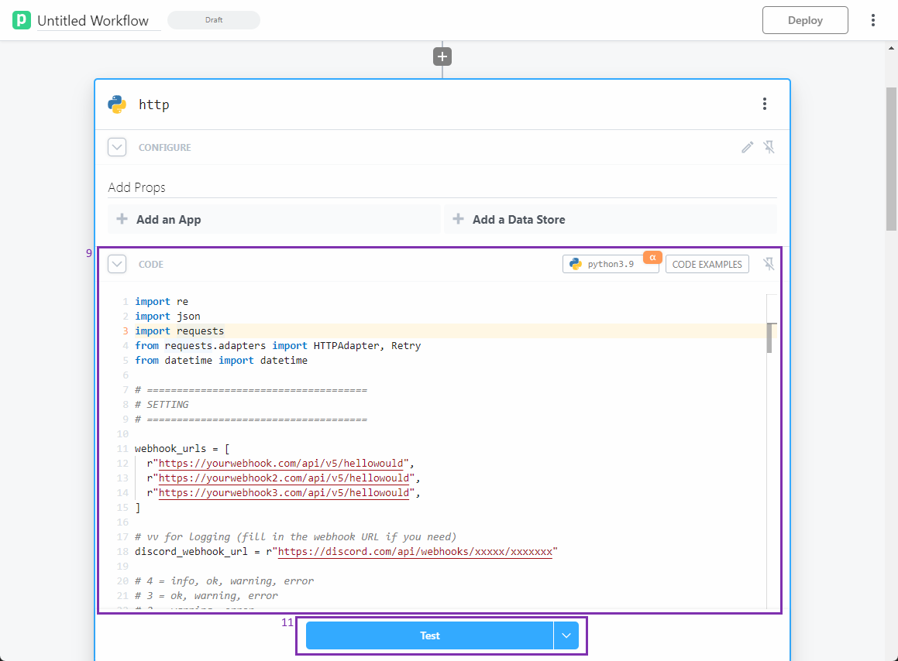
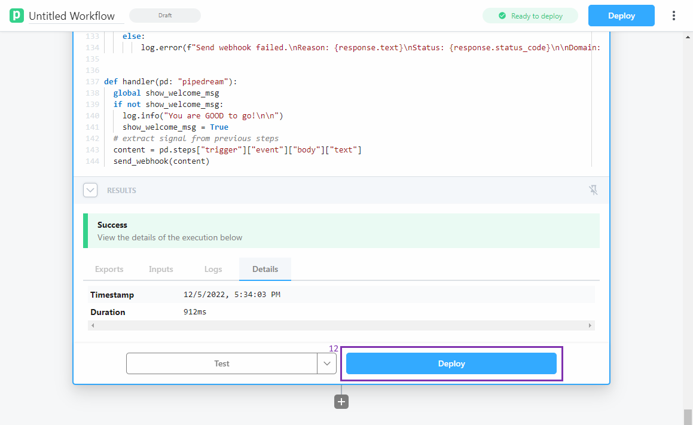

# Getting Started with [pipedream]((https://pipedream.com/))

[🔙 Back to cloud-versions.md](/docs/cloud-versions/cloud-versions.md)

<a name="shortcuts"></a>
## 🌻 Shortcuts
- [Requirements](#requirements)
- [Setup](#setup)
- [Configuration](#configuration)
- [Special Thanks](#special-thanks)

<a name="requirements"></a>
## ⚓ Requirements
* A [TradingView](https://www.tradingview.com/) account
* A [pipedream](https://pipedream.com/) account
* A [Discord](https://discord.com/) account (optional)

<a name="setup"></a>
## 👣 Setup
1. Login to [pipedream](https://pipedream.com/) and create a new workflow.

2. Select `New Emails` as the trigger.

3. Copy the email address given by pipedream and paste it into the `Email-to-SMS` field in your TradingView account. (You can follow this [instruction](https://www.tradingview.com/support/solutions/43000474398-how-to-change-the-email-to-sms-address-used-for-alert-notifications/) to change the `Email-to-SMS` email address.)
4. In order to find out the `Email-to-SMS` update verification code, you need to click the event dropdown menu below the given email address and select the verification email.

5. Find your verification code under `steps.trigger -> event -> body -> text` and paste it back into the `Email-to-SMS` field.
6. Click the "Continue" button.

7. Select `HTTP / Webhook`.

8. Select `Use any HTTP / Webhook API in Python`.

9. Copy the code [[Click ME](/cloud-versions/pipedream.py)] and paste it into pipedream's code editor.

    > ⚠️ You may have to copy and paste the code by splitting it into small parts if you can't paste the whole code at once. Please make sure all indent are correct.

10. Input your configuration. [[Click ME]((#configuration))]

11. Click the "Test" button.

You will receive the welcome message in your Discord if you have configured the Discord webhook URL and set the `log_level` to `4`.


12. Click the "Deploy" button after you see the "Success" message.


13. You are good to go!

<a name="configuration"></a>
## ⚙️ Configuration
1. `webhook_urls` - Webhook URLs you want to send the alert to. You can add multiple URLs by separating them with a comma.
```python
# Single URL:
webhook_urls = [
    r"https://mywebhook.com/1",
]

# Multi URLs:
webhook_urls = [
    r"https://mywebhook.com/1",
    r"https://mywebhook.com/2",
    r"https://mywebhook.com/3",
    # ...
]
```
> 🐳Tips: It is a good idea to test your signal or the program using a webhook test service such as [webhook.site](https://webhook.site/) instead of using your production webhook.
2. `discord_webhook_url` - (Optional) Discord webhook URL. Mainly for logging purposes. Leave it blank if you don't want to use it.

<a name="special-thanks"></a>
## 💖 Special Thanks
<table>
  <tr>
  <td align="center">
    <a href="https://github.com/Priyanshu-raj95">
      
      <br><sub><b>Priyanshu-raj95</b></sub>
    </a>
  </td>
  </tr>
</table>