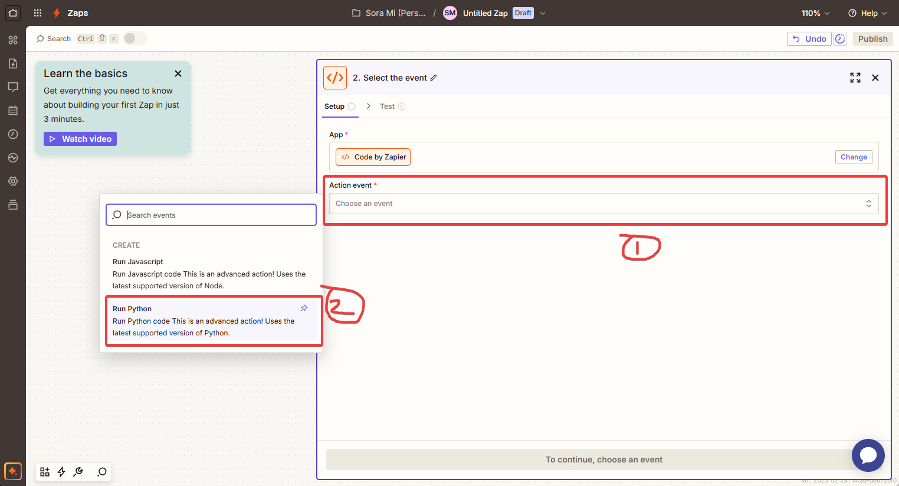
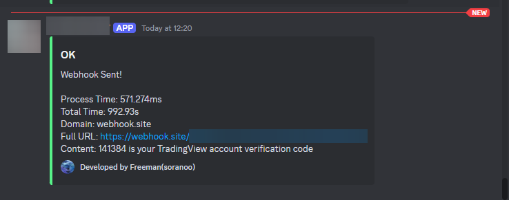

# Getting Started with [zapier]((https://zapier.com/))

[🔙 Back to cloud-versions.md](/docs/cloud-versions/cloud-versions.md)

## 🌻 Shortcuts
- [Requirements](#-requirements)
- [Setup](#-setup)
- [Configuration](#-configuration)

## ⚓ Requirements
* A [TradingView](https://www.tradingview.com/) account
* A [zapier](https://zapier.com/) account
* A [Discord](https://discord.com/) account (optional)

## 👣 Setup
1. Login to [zapier](https://zapier.com/) and create a new workflow (Zap).

2. Press into the trigger node.

3. Select `Emails` as the trigger.

4. Press the `Choose an event` box then select `New inbound email`.

5. Press the `Continue` button.
6. Enter your custom email address and press the `Continue` button.

7. Copy the email address given by zapier.

8. Open your TradingView account and chanage the `Alternate email for alerts` to the email address given by zapier.

9. Paste the copied email address into the `Account verification` dialog email field and press `Get code` button.

10. Back to zapier and press the `Test trigger` button.

11. Press `Email A` and scroll down to find the verification code (from `Body Plain`).

12. Paste the verification code into the TradingView `Account verification` dialog and press the `Submit` button.

13. Back to zapier and close the side panel.
14. Select the action node.

15. Search for `Code` and select it.

16. Press the `Choose an event` box then select `Run Python`.

17. Press the `Continue` button.
18. Add the following variables to the `Input Data` table.
    | Key | Value |
    | --- | --- |
    | signal | `{{Body Plain}}` |
    | from_email | `{{From Email}}` |
    | sent_datetime | `{{Raw Date}}` |

    
19. Copy the code [[Click ME](/cloud-versions/zapier.py)] and paste it into the code editor.
20. Input your configuration. [[Click ME](#configuration)]
21. Press the `Continue` button.
22. Press the `Test step` button.
23. If you have configured the Discord webhook URL, you will receive a similar message in your Discord.


> [!NOTE]\
> The content will be your signal message when TradingView starts sending the signal.

24. Press the `Publish` button.
25. Name your Zap and press the `Turn on Zap` button.

## ⚙️ Configuration
1. `webhook_urls` - Webhook URLs you want to send the alert to. You can add multiple URLs by separating them with a comma.
```python
# Single URL:
webhook_urls = [
    r"https://mywebhook.com/1",
]

# Multi URLs:
webhook_urls = [
    r"https://mywebhook.com/1",
    r"https://mywebhook.com/2",
    r"https://mywebhook.com/3",
    # ...
]
```
> [!NOTE]\
> It is a good idea to test your signal or the program using a webhook test service such as [webhook.site](https://webhook.site/) instead of using your production webhook.

2. Telegram notification
- `tg_bot_token` - Telegram bot token.
- `tg_chat_id` - Telegram chat ID.

3. `discord_webhook_url` - (Optional) Discord webhook URL. Mainly for logging purposes. Leave it blank if you don't want to use it.

